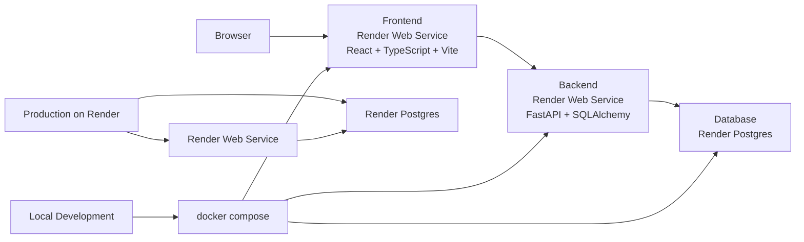
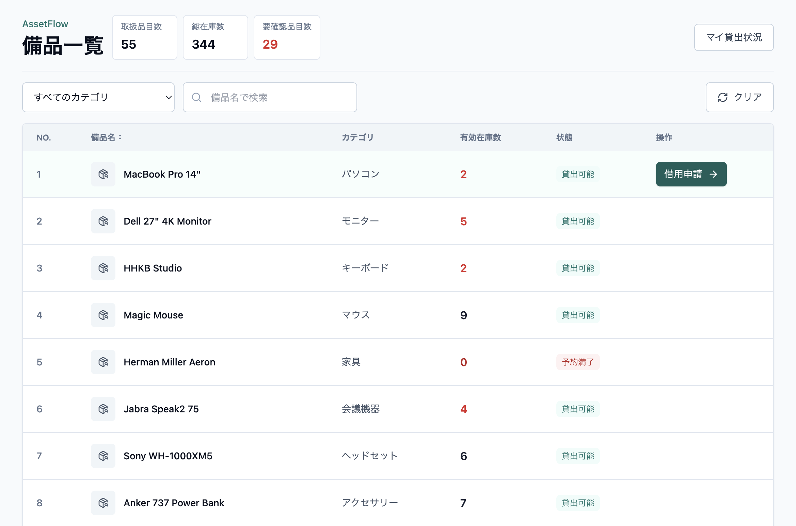
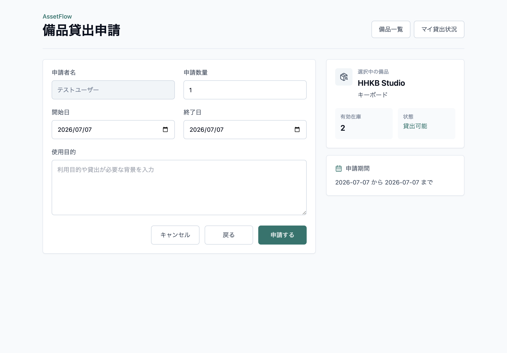
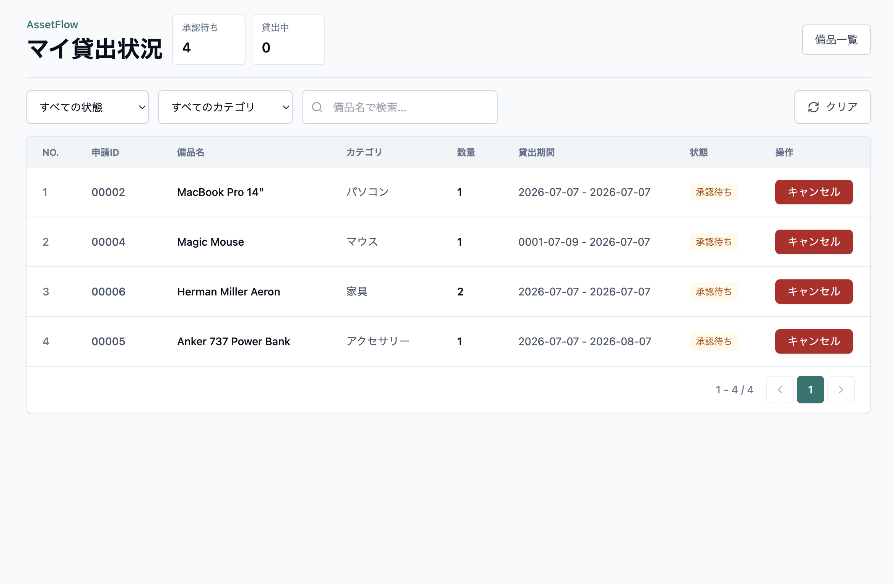

# AssetFlow Portfolio

AssetFlow は、社内備品の管理フローを見せるためのポートフォリオ用 Web アプリです。

このリポジトリは、フロントエンドとバックエンドを分けた構成で、ローカルでは Docker Compose で、公開環境では Render を使って動かす前提で整理しています。

> [!NOTE]
> 公開環境は Render の Free プランを利用しています。一定時間アクセスがないとサービスがスリープするため、最初のアクセス時は起動まで最大 1 分ほど待ち時間が発生する場合があります。画面がすぐに切り替わらない場合は、少し待ってから再読み込みしてください。

## 公開URL

- フロントエンド: [https://asset-flow-portfolio-frontend.onrender.com/](https://asset-flow-portfolio-frontend.onrender.com/)
- バックエンド: [https://asset-flow-portfolio.onrender.com](https://asset-flow-portfolio.onrender.com)
- Swagger UI: [https://asset-flow-portfolio.onrender.com/docs](https://asset-flow-portfolio.onrender.com/docs)
- GitHub Repository: [https://github.com/amera-pino/asset-flow-portfolio](https://github.com/amera-pino/asset-flow-portfolio)

バックエンドのルート `/` は API 用のため `Not Found` を返します。API の確認は Swagger UI の `/docs` を使ってください。

## アプリの目的

AssetFlow の目的は、備品管理の基本的な流れをシンプルに見せることです。

- 備品一覧を確認する
- 備品を借用申請する
- 自分の申請状況を確認する
- 返却やキャンセルの流れを確認する

学習用のポートフォリオではありますが、実務で見ても違和感の少ない構成と説明を意識しています。

## 全体構成図



## ローカル起動方法

ローカルでは `docker compose` でまとめて起動します。

```bash
docker compose up -d
```

よく使う確認先は次のとおりです。

- フロントエンド: `http://localhost:5173`
- バックエンド: `http://localhost:8000`
- ヘルスチェック: `http://localhost:8000/health`

バックエンドだけ確認したい場合は、`backend/README.md` を見てください。
フロントエンドだけ確認したい場合は、`frontend/README.md` を見てください。

## Render 上の公開構成

公開環境では、次の 3 つを分けて使っています。

- Render Web Service（フロントエンド）
  - React + Vite のフロントエンドを配置
- Render Web Service（バックエンド）
  - FastAPI バックエンドを配置
- Render Postgres
  - PostgreSQL を配置

Render 側では、サービス設定を環境変数で行います。  
DB 接続情報は Render の Postgres から得た接続文字列を、Web Service の環境変数として設定します。

Render を選んだ理由は、公開までの手順が比較的シンプルで、今回の規模なら運用も軽く始めやすいと考えたためです。
クラウド基盤としては AWS なども検討対象になりますが、このポートフォリオでは、実装と公開の流れを分かりやすく見せることを優先して Render を採用しています。

Render の公式ドキュメントでは、環境変数でサービス設定を行い、Postgres は同一リージョンで internal URL を使う構成が案内されています。

参考:

- [Environment Variables and Secrets – Render Docs](https://render.com/docs/configure-environment-variables)
- [Create and Connect to Render Postgres – Render Docs](https://render.com/docs/postgresql-creating-connecting)

## `.env.example` の使い方

このリポジトリには、公開前提のサンプル設定として [.env.example](./.env.example) を置いています。

使い方は次のとおりです。

1. `.env.example` をコピーして `.env` を作る
2. ローカル実行に必要な値を入れる
3. `.env` は GitHub に push しない

主に入れる項目は次のとおりです。

- `POSTGRES_DB`
- `POSTGRES_USER`
- `POSTGRES_PASSWORD`
- `DATABASE_URL`
- `CORS_ORIGINS`
- `VITE_API_BASE_URL`

## DB の扱い

ローカルでは、`docker compose` に含めた PostgreSQL を使います。  
公開環境では、Render Postgres を別サービスとして使います。

このリポジトリでは、DB の接続先はコードに直書きせず、環境変数で渡す前提です。

- ローカル
  - `docker compose` で PostgreSQL を立てる
  - `.env` で接続情報を持つ
- Render
  - Render Postgres を別サービスとして作る
  - Web Service 側に接続情報を環境変数で設定する

DB の初期データは、必要に応じて `backend/app/seeds.py` で投入できます。

## 実装の意図

このアプリは、備品の一覧閲覧、借用申請、返却、キャンセル、管理者による承認フローまでを一連の流れとして見せることを意識して実装しました。
単なる一覧画面ではなく、申請から管理までの業務のつながりが伝わる構成にしています。

## 使い方

このデモでは、一般ユーザーとして備品の利用申請フローを確認できます。

1. 備品一覧でカテゴリやキーワードを使って対象の備品を探す
2. `借用申請` ボタンから申請画面へ進む
3. 申請内容を入力して送信する
4. `マイ貸出状況` で承認待ちや貸出中の状態を確認する
5. 承認待ちの申請はキャンセルできる

## スクリーンショット

### 備品一覧



### 備品貸出申請



### マイ貸出状況



## 補足

- 備品一覧では、操作ボタンが表の右側に表示されます。
- 在庫がない備品は `予約満了` と表示され、借用申請ボタンは表示されません。

## 詳細 README へのリンク

- [backend/README.md](./backend/README.md)
- [frontend/README.md](./frontend/README.md)

## 実装計画

- 【済】一般ユーザー向け画面
  - 備品一覧画面
  - 備品検索
  - 借用申請画面
  - マイ貸出状況画面
- 【済】申請・貸出 API
  - 申請データ作成 API
  - 返却 API
  - 承認待ち申請のキャンセル API
- 【済】表示ロジック
  - 在庫数と承認待ち数量を考慮した表示
- 【未実装】認証・権限制御
  - ログイン画面
  - 一般ユーザー / 管理者の権限制御
  - アプリ起動直後のログイン分岐
- 【未実装】管理者向け画面
  - 管理者用の備品一覧管理
  - 新規備品登録
  - 承認待ち一覧
  - 貸し出し中一覧
  - 承認待ちステータスの承認・却下
  - 一般ユーザーの貸出開始ステータス遷移

管理者画面は、一般ユーザーと同じ備品一覧を起点にしつつ、画面内のタブやボタンで管理機能へ切り替える構成を想定しています。

また、フロントエンドとバックエンドは、それぞれ単独でも確認しやすいように分けてあります。

## テスト計画

- 【一部実施済み】単体テスト
  - フロントエンド
    - ツール: `Vitest` + `React Testing Library`
    - 確認内容: 画面表示、入力、ボタン押下、状態切り替え
    - 補助: API 呼び出し部分は `MSW` でモックする
  - バックエンド
    - ツール: `pytest`
    - 確認内容: API バリデーション、サービス層、状態遷移、レスポンス内容
    - 補助: DB を使う処理はテスト用 DB かトランザクション rollback で分離する
    - 補足: バックエンドは `pytest` を 1 件実装済み
- 【未実施】結合テスト
  - フロントエンドとバックエンドの連携
    - ツール: `Playwright`
    - 確認内容: 画面から API を呼び、画面表示が正しく変わるかを確認する
  - バックエンドと DB の連携
    - ツール: `pytest` + `FastAPI TestClient` か `httpx`
    - 確認内容: API が DB に正しく登録・更新できるかを確認する
    - 補助: 必要に応じて `curl` で疎通確認する
- 【未実施】総合テスト
  - ツール: `Playwright`
  - 確認内容: ログイン後の一連の業務シナリオ、一般ユーザーと管理者の分岐、主要な画面遷移
  - 補助: 必要に応じてブラウザ操作、`curl`、DB 確認を併用する
  - 補足:
    - `Playwright` は、テストランナー、待機処理、レポートまでまとまっていて扱いやすい
    - この構成のようなフロント主導の E2E / 総合テストと相性が良い
    - `Selenium` はブラウザ自動化のエコシステムが広い
    - 今回は、記述のしやすさと運用のしやすさを優先して `Playwright` を採用する
- 【要検討中】回帰テスト
  - ツール: `Vitest` / `pytest` / `Playwright`
  - 確認内容: 変更後に既存機能が壊れていないかを確認する
  - 補助: 必要に応じて目視確認を挟む
- 【要検討中】スモークテスト
  - ツール: `Playwright` / `curl`
  - 確認内容: デプロイ直後に主要機能が最低限動くかを確認する
  - 補助: 主要画面の目視確認を少しだけ挟む
- 【要検討中】アクセシビリティ確認
  - ツール: `Playwright`
  - 確認内容: ラベル、フォーカス移動、キーボード操作を確認する
  - 補助: 画面の見え方は目視で確認する
- 【要検討中】レスポンシブ確認
  - ツール: `Playwright`
  - 確認内容: PC、タブレット、スマホ幅で崩れないかを確認する
  - 補助: ブラウザでの目視確認を併用する
- 【要検討中】権限制御確認
  - ツール: `Playwright`
  - 確認内容: 一般ユーザーと管理者で表示される機能が正しく分かれるかを確認する
  - 補助: 画面表示の差分は目視でも確認する
- 【保留】負荷テスト
  - このアプリの性質上、現時点では優先度を下げる

ローカルでの検証はできていますが、この README 時点では、上記の自動化テスト計画はまだこれから整える段階です。

## CI/CD

このリポジトリでは、GitHub Actions で CI を実行します。  
feature ブランチから `main` 向けの Pull Request を作成したときに、次のチェックを自動で走らせます。

- バックエンド
  - `pytest`
  - `ruff check .`
- フロントエンド
  - `npm ci`
  - `npm run build`

`main` への push 時にも同じ CI を実行するので、PR の確認とマージ後の最終確認を同じ基準でそろえられます。
バックエンドは `main` にマージされたあと、Render Web Service 側で自動デプロイされる構成です。  
フロントエンドは Render 上で公開していますが、現時点では手動デプロイで運用しています。  
そのため、基本の流れは「PR で GitHub Actions の CI を通す」「マージ後にバックエンドが自動で本番反映される」という形です。

## 今後の拡張方針

- 認証機能を追加し、一般ユーザーと管理者の画面を分ける
- 管理者向けに、備品登録、承認、貸し出し管理を実装する
- テスト計画を順次進め、単体・結合・総合の各レイヤーを整える
- 公開後はスクリーンショットや操作デモを追加し、画面の流れを分かりやすくする

## デモの見どころ

- デモではログイン済みの想定ユーザーとして「テストユーザー」を固定している
- 備品一覧から借用申請までの流れ
- マイ貸出状況での確認
- 返却とキャンセルの分岐
- ローカル開発と Render 公開の分離
- `.env.example` を使った公開前提の設定整理
