# AssetFlow Portfolio

AssetFlow は、社内備品の管理フローを見せるためのポートフォリオ用Webアプリです。

PC とスマホの両方で閲覧・操作できるようにしています。

このリポジトリは、フロントエンドとバックエンドを分けた構成で、ローカルでは Docker Compose で、公開環境では Render を使って動かす前提で整理しています。

> [!NOTE]
> 公開環境は Render の Free プランを利用しています。
> - 一定時間アクセスがないとサービスがスリープする
> - スリープ後の最初のアクセスは、起動まで最大 1 分ほどかかる
> - 起動後も DB の読み込みに数十秒かかる場合がある
> - 表示が進まないときは少し待ってから再読み込みする

## 公開URL

- AssetFlow: [https://asset-flow-portfolio.onrender.com/](https://asset-flow-portfolio.onrender.com/)
- Swagger UI: [https://asset-flow-portfolio-api.onrender.com/docs](https://asset-flow-portfolio-api.onrender.com/docs)
- GitHub Repository: [https://github.com/amera-pino/asset-flow-portfolio](https://github.com/amera-pino/asset-flow-portfolio)

## デモ用アカウント

- 一般ユーザー
  - ユーザーID: `user@example.com`
  - パスワード: `AssetFlow2026!`
- 管理ユーザー
  - ユーザーID: `admin@example.com`
  - パスワード: `AssetFlow2026!`

## スクリーンショット

### 一般ユーザー向け

#### ログイン画面

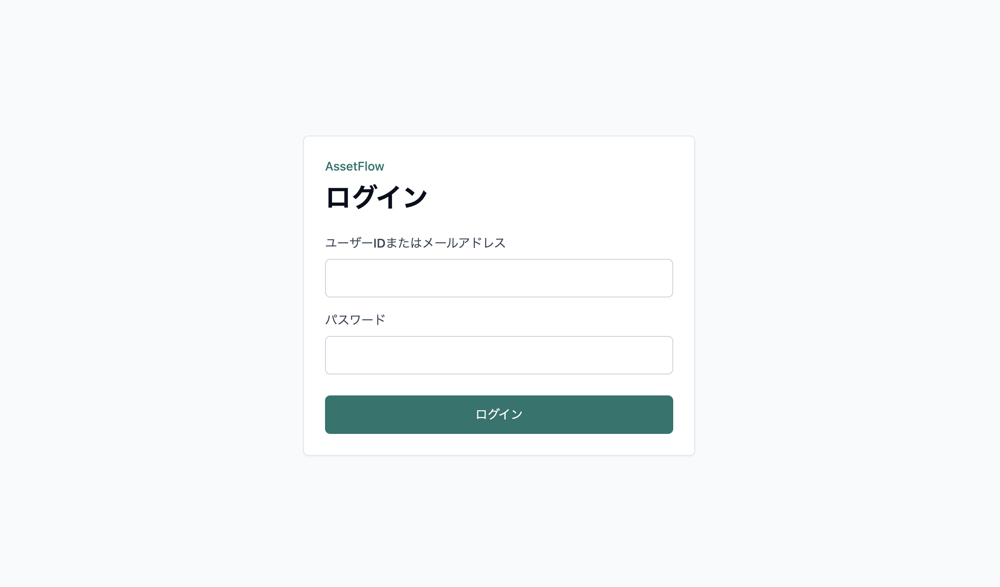

#### 備品一覧

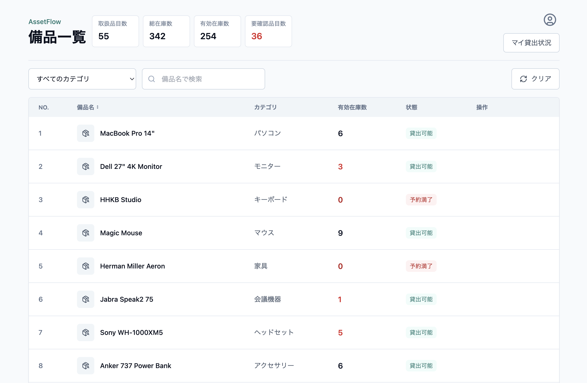

※ 有効在庫数が 1 以上の備品には、操作列に `貸出申請` ボタンが表示されます。  
※ 有効在庫数が 0 の備品は `予約満了` と表示され、`貸出申請` ボタンは表示されません。

#### 備品貸出申請

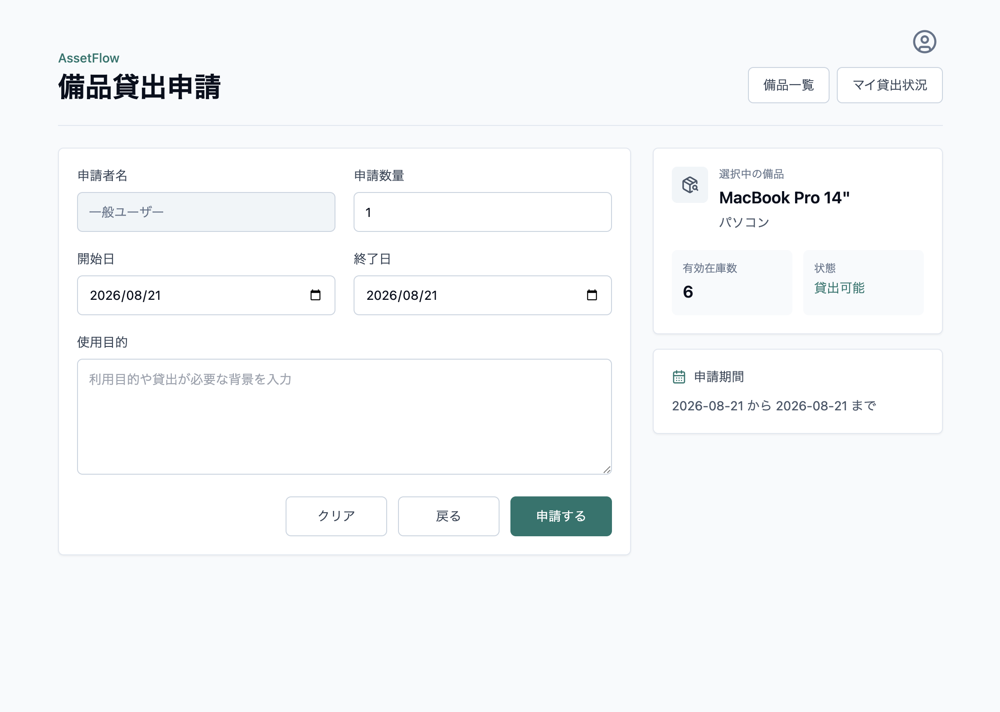

#### マイ貸出状況

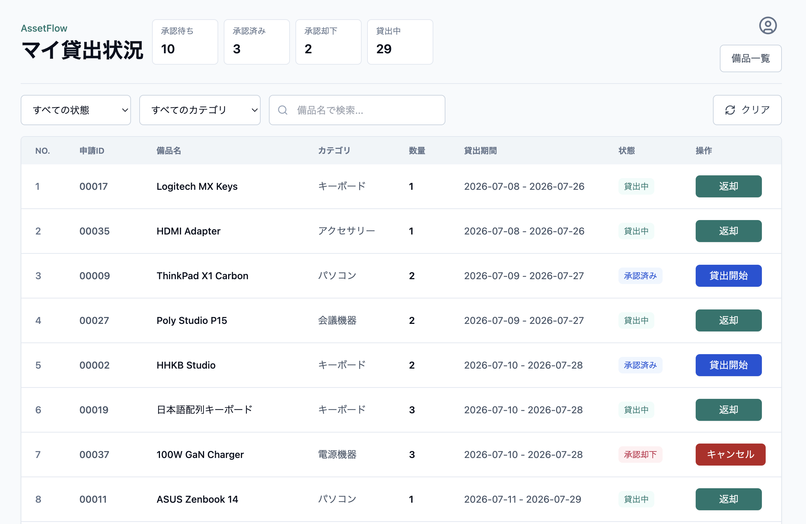

### 管理ユーザー向け

#### 管理者メニュー: ホーム

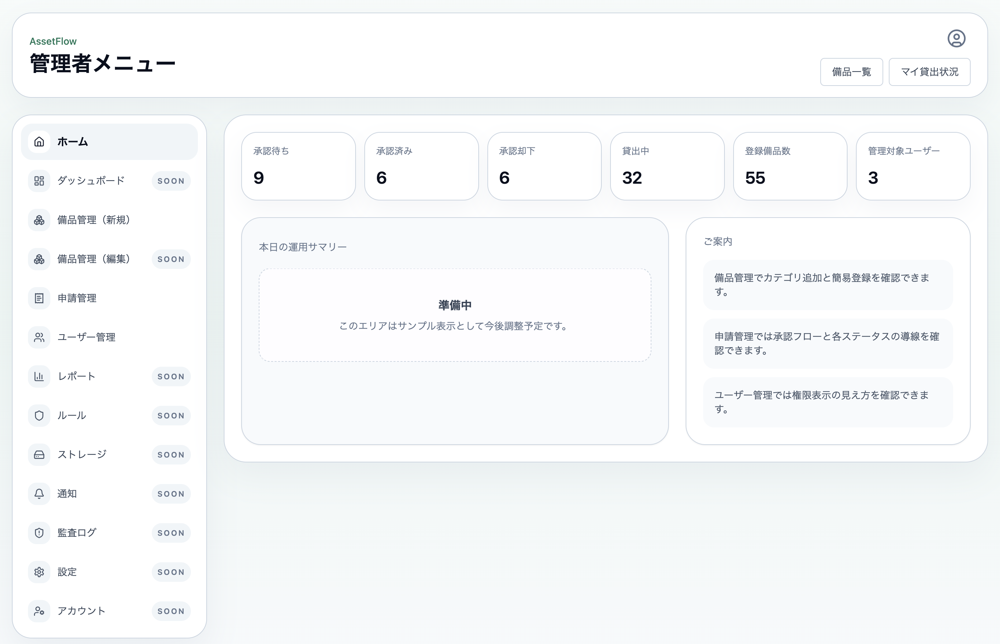

#### 管理者メニュー: 備品管理（新規）

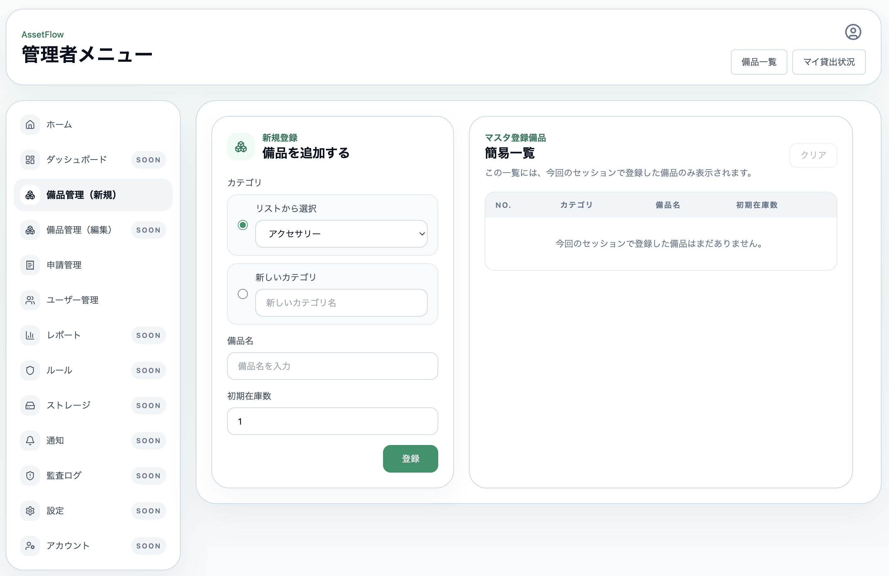

#### 管理者メニュー: 備品管理（編集） ※準備中

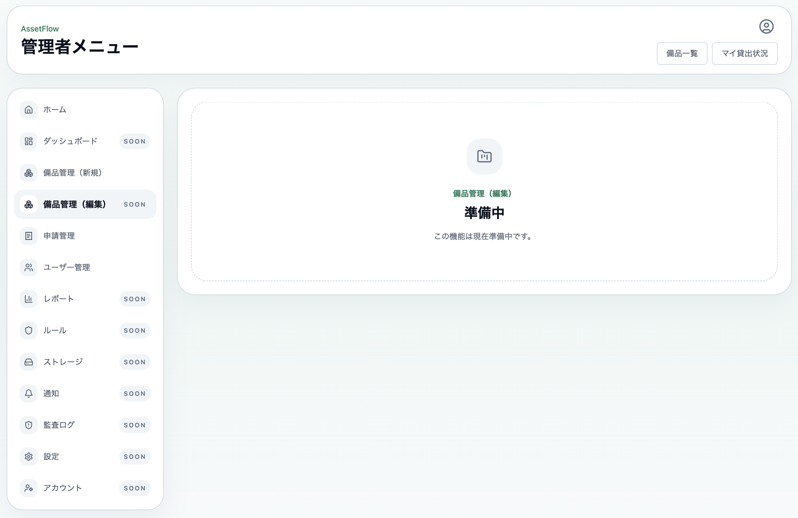

#### 管理者メニュー: 申請管理

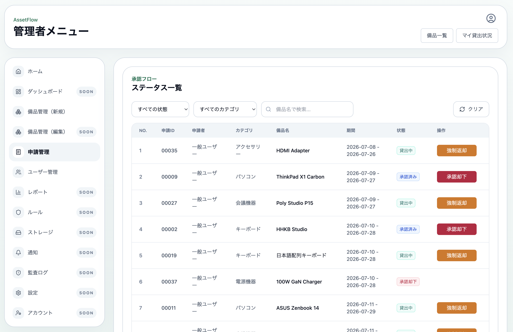

#### 管理者メニュー: ユーザー管理

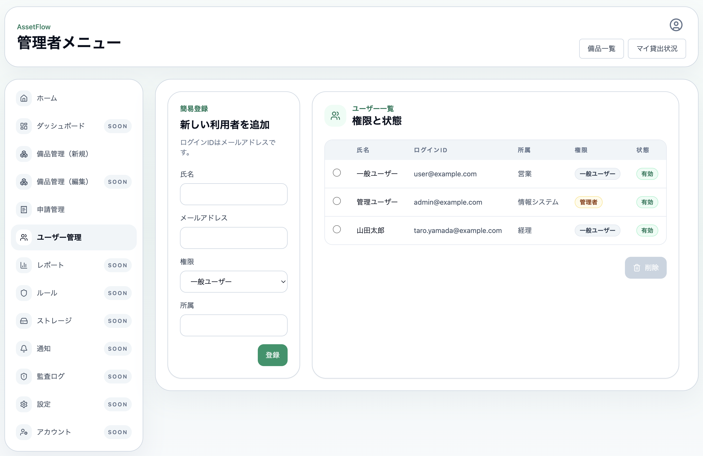

## アプリの使い方

AssetFlow では、一般ユーザーの備品利用フローと、管理ユーザーの管理フローを分けて確認できます。

### 一般ユーザー画面

- ログイン: 一般ユーザーとしてログインする
  ※ 一般ユーザーのログイン情報は、上記の `デモ用アカウント` を参照
- 備品一覧: 備品一覧を確認する
- 備品貸出申請: 備品の貸出申請をする
- マイ貸出状況: 自分の申請状況を確認し、貸出開始、キャンセル、返却を行う

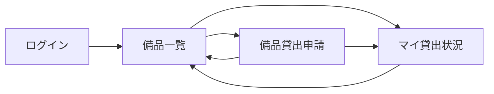
```mermaid
flowchart LR
    A["ログイン"] --> B["備品一覧"]
    B --> C["備品貸出申請"]
    B --> D["マイ貸出状況"]
    C --> D
    C --> B
    D --> B
```

### 管理ユーザー画面

- ログイン: 管理ユーザーとしてログインする
  ※ 管理ユーザーのログイン情報は、上記の `デモ用アカウント` を参照
- 備品一覧: 一般ユーザーと同じ備品一覧を確認する
- 備品貸出申請: 一般ユーザーと同じ備品貸出申請を行う
- マイ貸出状況: 一般ユーザーと同じマイ貸出状況を確認する
- 管理者メニュー
  - ホーム: 管理対象の概要を確認する
  - 備品管理（新規）: 備品マスタを追加する
  - 備品管理（編集）: 備品マスタの編集や削除を行う ※準備中
  - 申請管理: 申請一覧とステータス変更を行う
  - ユーザー管理: 利用者アカウントを追加または削除する

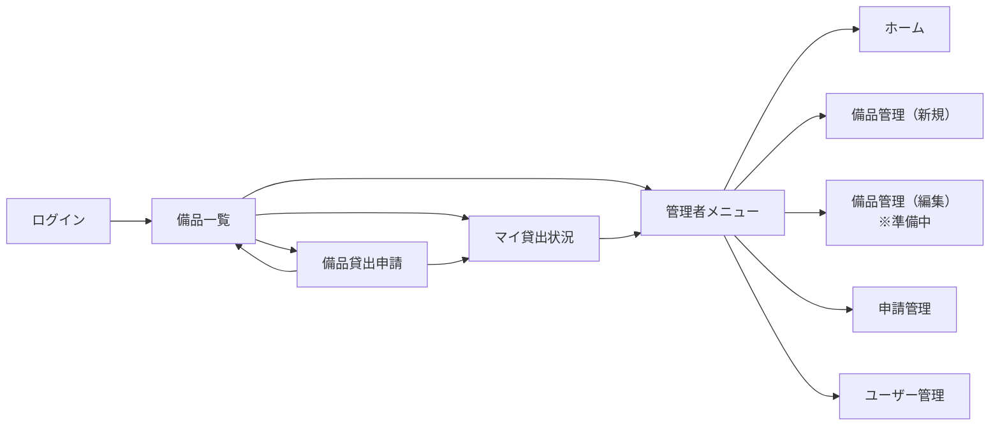
```mermaid
flowchart LR
    A["ログイン"] --> B["備品一覧"]
    B --> C["備品貸出申請"]
    B --> D["マイ貸出状況"]
    B --> E["管理者メニュー"]
    C --> D
    C --> B
    D --> E
    E --> H["ホーム"]
    E --> F["備品管理（新規）"]
    E --> G["備品管理（編集）<br/>※準備中"]
    E --> I["申請管理"]
    E --> J["ユーザー管理"]
```

## システム構成

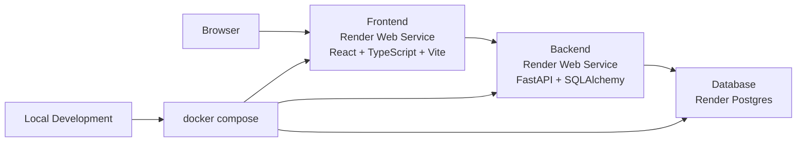
```mermaid
flowchart LR
    A["Browser"] --> B["Frontend<br/>Render Web Service<br/>React + TypeScript + Vite"]
    B --> C["Backend<br/>Render Web Service<br/>FastAPI + SQLAlchemy"]
    C --> D["Database<br/>Render Postgres"]

    E["Local Development"] --> F["docker compose"]
    F --> B
    F --> C
    F --> D
```

## ローカル起動方法

ローカルでは `docker compose` でまとめて起動します。

```bash
docker compose up -d
```

よく使う確認先は次のとおりです。

- フロントエンド: `http://localhost:5173`
- バックエンド: `http://localhost:8000`
- ヘルスチェック: `http://localhost:8000/health`

## Render 上の公開構成

公開環境では、次の 3 つを分けて使っています。

- Render Web Service（フロントエンド）
  - React + Vite のフロントエンドを配置
- Render Web Service（バックエンド）
  - FastAPI バックエンドを配置
- Render Postgres
  - PostgreSQL を配置

Render 側では、サービス設定を環境変数で行います。  
DB 接続情報は Render の Postgres から得た接続文字列を、Web Service の環境変数として設定します。

Render を選んだ理由は、公開までの手順が比較的シンプルで、今回の規模なら運用も軽く始めやすいと考えたためです。
クラウド基盤としては AWS なども検討対象になりますが、このポートフォリオでは、実装と公開の流れを分かりやすく見せることを優先して Render を採用しています。

Render の公式ドキュメントでは、環境変数でサービス設定を行い、Postgres は同一リージョンで internal URL を使う構成が案内されています。

参考:

- [Environment Variables and Secrets – Render Docs](https://render.com/docs/configure-environment-variables)
- [Create and Connect to Render Postgres – Render Docs](https://render.com/docs/postgresql-creating-connecting)

## `.env.example` の使い方

このリポジトリには、公開前提のサンプル設定として [.env.example](./.env.example) を置いています。

使い方は次のとおりです。

1. `.env.example` をコピーして `.env` を作る
2. ローカル実行に必要な値を入れる
3. `.env` は GitHub に push しない

主に入れる項目は次のとおりです。

- `APP_ENV`
- `LOG_TO_FILE`
- `POSTGRES_DB`
- `POSTGRES_USER`
- `POSTGRES_PASSWORD`
- `DATABASE_URL`
- `CORS_ORIGINS`
- `VITE_API_BASE_URL`

## DB接続構成

ローカルでは、`docker compose` に含めた PostgreSQL を使います。  
公開環境では、Render Postgres を別サービスとして使います。

このリポジトリでは、DB の接続先はコードに直書きせず、環境変数で渡す前提です。

- ローカル
  - `docker compose` で PostgreSQL を立てる
  - `.env` で接続情報を持つ
- Render
  - Render Postgres を別サービスとして作る
  - Web Service 側に接続情報を環境変数で設定する

## 主要テーブル

- ユーザー情報（`users` テーブル）: ログイン利用者と管理ユーザーの基本情報を管理する
- 備品情報（`assets` テーブル）: 備品名、カテゴリ、在庫数、利用状態を管理する
- 貸出申請情報（`asset_loan_requests` テーブル）: 利用申請、承認待ち、承認済み、貸出中、返却、キャンセルなどの状態を管理する
- セッション情報（`user_sessions` テーブル）: ログイン中ユーザーのセッション状態を管理する

このポートフォリオでは、画面確認とデモ利用がしやすいように、`backend/app/seeds.py` で初期データを投入してあります。

詳細な初期データの内容は、[AssetFlowテスト仕様書](https://amera-pino.github.io/asset-flow-portfolio/test-design/assetflow-test-cases.html) の `テストデータ` タブで確認できます。
また、各テーブルの列構成は、`テストデータ` タブに掲載している CSV の 1 行目でも確認できます。

## 画面と API の対応

主要な画面名と API 名は、リポジトリ内でも次の呼び方にそろえています。

### 画面名

| 正式名称 | 対応するフロントエンド |
| --- | --- |
| ログイン | `LoginPage` |
| 備品一覧 | `AssetListPage` |
| 備品貸出申請 | `AssetLoanRequestPage` |
| マイ貸出状況 | `MyLoanRequestPage` |
| 管理者メニュー: ホーム | `AdminPage` |
| 管理者メニュー: 備品管理（新規） | `AdminPage` |
| 管理者メニュー: 備品管理（編集） ※準備中 | `AdminPage` |
| 管理者メニュー: 申請管理 | `AdminPage` |
| 管理者メニュー: ユーザー管理 | `AdminPage` |

### 主要 API

#### ログイン・共通

| 正式名称 | メソッド | パス | 主な利用画面 | 用途 |
| --- | --- | --- | --- | --- |
| ログインAPI | `POST` | `/api/auth/login` | ログイン | ログインIDとパスワードを受け取り、ログイン状態を開始する |
| ログイン状態取得API | `GET` | `/api/auth/me` | ログイン、備品一覧、マイ貸出状況、管理者メニュー | 現在のログインユーザー情報を取得する |
| ログアウトAPI | `POST` | `/api/auth/logout` | 備品一覧、マイ貸出状況、管理者メニュー | ログイン中セッションを終了する |

#### 一般ユーザー

| 正式名称 | メソッド | パス | 主な利用画面 | 用途 |
| --- | --- | --- | --- | --- |
| 備品一覧取得API | `GET` | `/api/assets` | 備品一覧 | 検索、カテゴリ、並び替え、ページング条件に合う備品一覧を取得する |
| 備品カテゴリ取得API | `GET` | `/api/assets/categories` | 備品一覧、管理者メニュー: 備品管理（新規） | カテゴリ絞り込み候補や備品登録時のカテゴリ候補を取得する |
| 備品情報取得API | `GET` | `/api/assets/{assetId}` | 備品貸出申請 | 貸出申請対象の備品情報を取得する |
| 申請登録API | `POST` | `/api/requests` | 備品貸出申請 | 入力された貸出申請を登録する |
| 貸出状況取得API | `GET` | `/api/requests/me/active` | マイ貸出状況 | ログイン中ユーザーの承認待ち、承認済み、貸出中の申請を取得する |
| 貸出開始API | `POST` | `/api/requests/{requestId}/start-loan` | マイ貸出状況 | 承認済み申請を貸出中へ更新する |
| 返却登録API | `POST` | `/api/requests/{requestId}/return` | マイ貸出状況 | 貸出中の申請を返却済みにする |
| 申請キャンセルAPI | `POST` | `/api/requests/{requestId}/cancel` | マイ貸出状況 | 承認待ちの申請をキャンセル済みにする |

#### 管理ユーザー

| 正式名称 | メソッド | パス | 主な利用画面 | 用途 |
| --- | --- | --- | --- | --- |
| 管理サマリー取得API | `GET` | `/api/admin/summary` | 管理者メニュー: ホーム | 承認待ち件数、貸出中件数、登録備品数、管理対象ユーザー数などの概要を取得する |
| 備品登録API | `POST` | `/api/assets` | 管理者メニュー: 備品管理（新規） | 新しい備品マスタを登録する |
| 管理用申請一覧取得API | `GET` | `/api/admin/requests/active` | 管理者メニュー: 申請管理 | 承認待ち、承認済み、貸出中の申請一覧を取得する |
| 申請承認API | `POST` | `/api/admin/requests/{requestId}/approve` | 管理者メニュー: 申請管理 | 承認待ち申請を承認済みにする |
| 申請却下API | `POST` | `/api/admin/requests/{requestId}/reject` | 管理者メニュー: 申請管理 | 承認待ち申請を却下する |
| 強制返却API | `POST` | `/api/admin/requests/{requestId}/force-return` | 管理者メニュー: 申請管理 | 貸出中の申請を管理側から返却済みにする |
| 管理ユーザー一覧取得API | `GET` | `/api/admin/users` | 管理者メニュー: ユーザー管理 | 登録済みユーザー一覧を取得する |
| 管理ユーザー登録API | `POST` | `/api/admin/users` | 管理者メニュー: ユーザー管理 | 新しい一般ユーザーまたは管理ユーザーを登録する |
| 管理ユーザー削除API | `DELETE` | `/api/admin/users/{userId}` | 管理者メニュー: ユーザー管理 | 対象の一般ユーザーを削除する |

## テスト

このポートフォリオでは、主要な動作を確認するために、次の自動化テストを実装しています。

- フロントエンド単体テスト: `Vitest` + `React Testing Library` + `jsdom` + `MSW`
- バックエンド単体テスト: `pytest`
- 結合テスト: `Vitest` + `React Testing Library` + `Docker Compose` 上の `FastAPI`
- E2E テスト: `Playwright`

詳細なテスト戦略、テストケース、テストデータは、[AssetFlowテスト仕様書](https://amera-pino.github.io/asset-flow-portfolio/test-design/assetflow-test-cases.html) を参照してください。

## CI/CD

このリポジトリでは、GitHub Actions で CI を実行しています。  
Pull Request を契機に、フロントエンド、バックエンド、結合テスト、E2Eテストをそれぞれ別ジョブで実行します。

- フロントエンド
  - `npm ci`
  - `npm run test:unit`
  - `npm run build`
- バックエンド
  - `pip install -r requirements.txt`
  - `pytest`
  - `ruff check .`
- 結合テスト
  - `docker compose --profile integration-test up -d --build backend-integration`
  - `npm run test:integration`
- E2Eテスト
  - `docker compose up -d db backend`
  - `npm run dev -- --host localhost --strictPort`
  - `npm run e2e`

CI はジョブごとに分けて実行し、テスト種別ごとの失敗箇所や実行時間を切り分けやすくしています。

`main` への直接 push は、ブランチプロテクションで禁止しています。  
本アプリは `main` にマージされたあと、Render Web Service 側で自動デプロイされる構成です。  
そのため、基本の流れは「Pull Request で GitHub Actions の CI を通す」「マージ後に自動デプロイされる」という形です。
