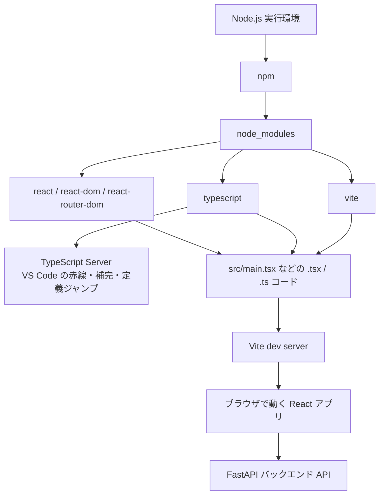
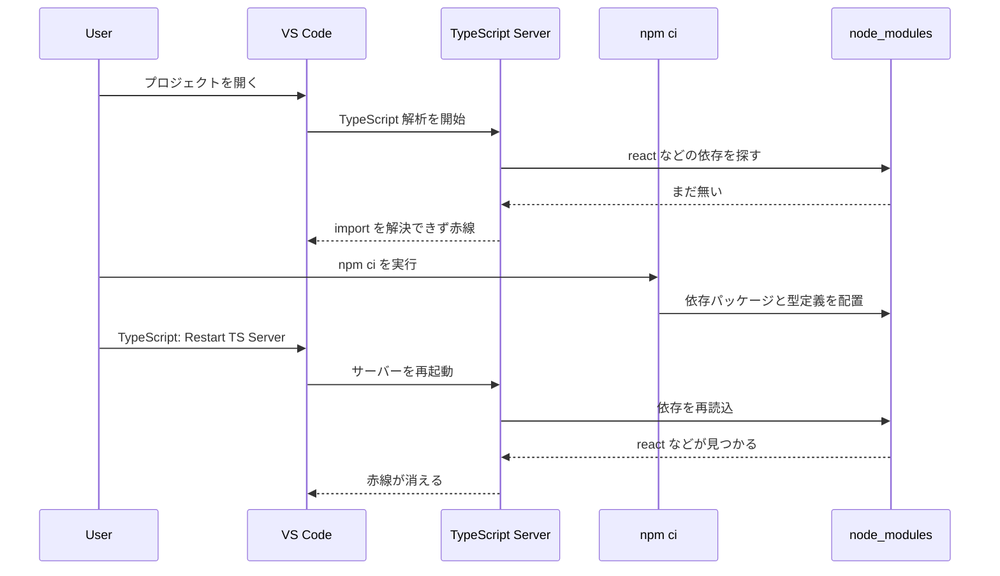
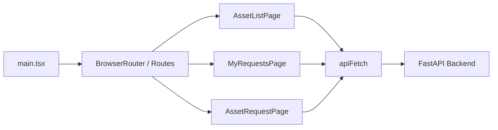

# Frontend Notes

このファイルは、`frontend` ディレクトリで開発するときのメモです。

- DevContainer 上で `react` などの import に赤線が出たときの復旧手順
- `npm` `node_modules` `TypeScript Server` `Vite` `React` の役割整理
- AssetFlow フロントエンドのざっくりした流れ

## このフロントエンドの前提

このフロントエンドは次の構成です。

- UI は `React`
- コードは `TypeScript`
- 開発サーバーは `Vite`
- 依存管理は `npm`
- API 通信先は FastAPI バックエンド

`package.json` にある依存パッケージは `npm ci` で `node_modules` に入ります。
VS Code の赤線や補完は、`TypeScript Server` がその `node_modules` を読んで解決しています。

## 赤線が出たときの復旧手順

DevContainer で開いた直後、`src/main.tsx` などで次のような import に赤線が出ることがあります。

- `react`
- `react-dom/client`
- `react-router-dom`

これはコードの文法ミスではなく、依存パッケージが未インストールだったり、VS Code 側が新しい依存をまだ読み直していないときに起こりやすいです。

### 手順

`frontend` ディレクトリで次を実行します。

```bash
cd /workspace/frontend
npm ci
```

そのあと、VS Code でコマンドパレットを開いて次を実行します。

1. `TypeScript: Restart TS Server`
2. まだ直らなければ `Developer: Reload Window`

今回の作業では、`npm ci` のあとに `TypeScript: Restart TS Server` を実行したら赤線が消え、参照先ジャンプもできるようになりました。

## なぜ `TypeScript: Restart TS Server` が必要なのか

`npm ci` は依存パッケージを実際にインストールするコマンドです。

一方で VS Code の赤線、補完、定義ジャンプは、VS Code 内で動く `TypeScript Server` が担当しています。
このサーバーは高速化のために、`node_modules` や `tsconfig.json` の情報をキャッシュしながら解析します。

そのため、プロジェクトを開いた時点では依存がまだ無く、あとから `npm ci` で一気に依存が増えた場合、VS Code 側がその変化をすぐ拾いきれないことがあります。

そのときに `TypeScript: Restart TS Server` を実行すると、TypeScript Server が再起動し、次を読み直します。

- `package.json`
- `tsconfig.json`
- `node_modules`
- 型定義ファイル

その結果、import 解決が最新状態になり、赤線が消えることがあります。

## 役割の整理

それぞれの役割は次のイメージです。

- `Node.js`
  - JavaScript をブラウザ外で動かす実行環境
- `npm`
  - 依存パッケージをインストール、管理する仕組み
- `node_modules`
  - `npm ci` で入ったライブラリの置き場所
- `TypeScript`
  - 型付きでコードを書くための言語と型チェック基盤
- `TypeScript Server`
  - VS Code の赤線、補完、定義ジャンプを担当する解析サーバー
- `React`
  - UI を組み立てるライブラリ
- `Vite`
  - 開発サーバーとフロントエンドのビルド担当

補足として、`node_modules` に入るのは `Node.js` 本体ではありません。
入るのは `react` `react-dom` `react-router-dom` `vite` `typescript` などの依存ライブラリです。

## 全体像



## 依存を入れてから赤線が消えるまでの流れ



## AssetFlow フロントエンドのざっくりした流れ

`src/main.tsx` では、`BrowserRouter` と `Routes` を使ってページを切り替えています。

- `/`
  - `AssetListPage`
- `/my-requests`
  - `MyRequestsPage`
- `/requests/:assetId`
  - `AssetRequestPage`

また、API 通信は `src/lib/api.ts` の `apiFetch` で共通化されています。
画面側はこの関数を通して FastAPI バックエンドへアクセスします。

`VITE_API_BASE_URL` はルートの `.env.example` で示している通り、公開環境に合わせて差し替えられるようにしています。



## よく使うコマンド

依存インストール:

```bash
cd /workspace/frontend
npm ci
```

開発サーバー起動:

```bash
cd /workspace/frontend
npm run dev -- --host 0.0.0.0
```

ビルド:

```bash
cd /workspace/frontend
npm run build
```
