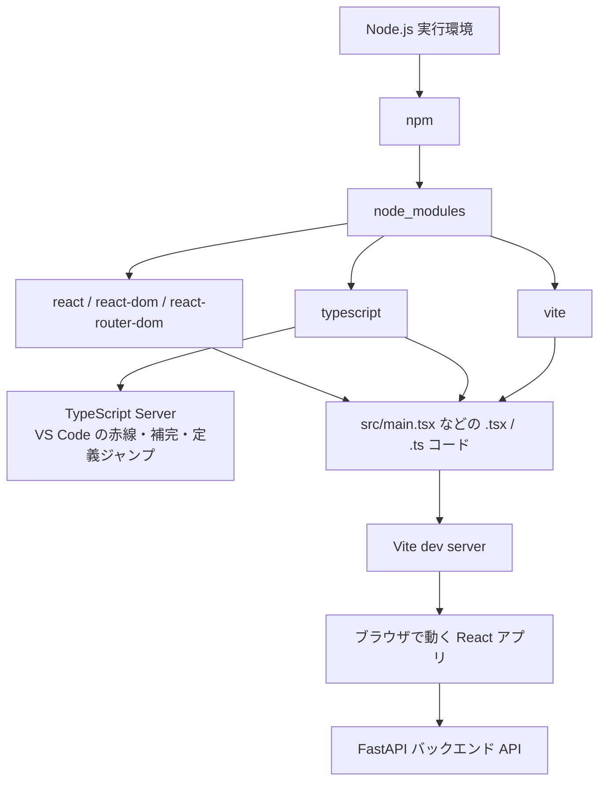
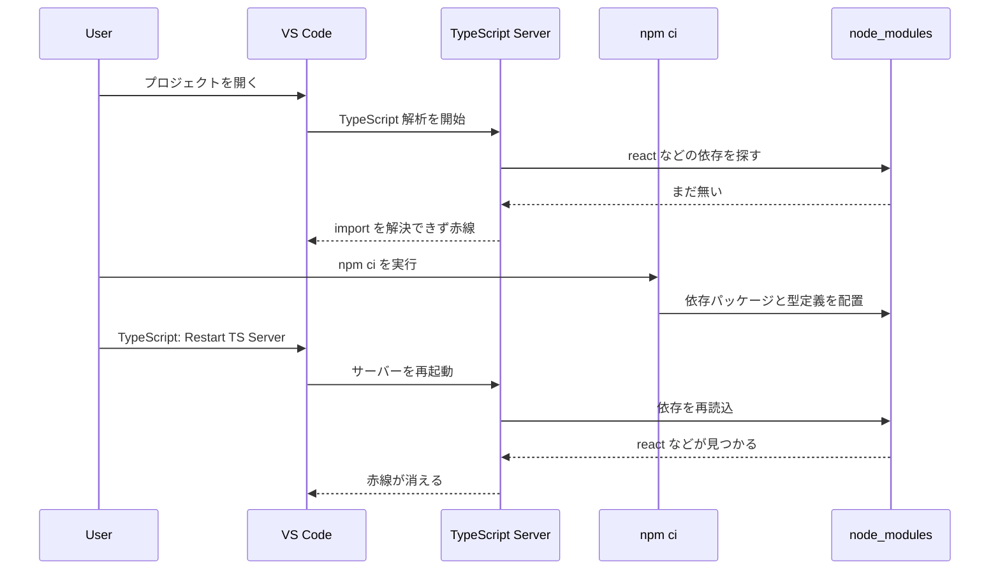
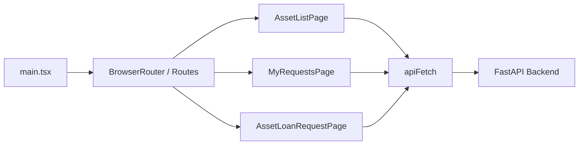

# Frontend Notes

このファイルは、`frontend` ディレクトリで開発するときのメモです。

- DevContainer 上で `react` などの import に赤線が出たときの復旧手順
- `npm` `node_modules` `TypeScript Server` `Vite` `React` の役割整理
- AssetFlow フロントエンドのざっくりした流れ

## このフロントエンドの前提

このフロントエンドは次の構成です。

- UI は `React`
- コードは `TypeScript`
- 開発サーバーは `Vite`
- 依存管理は `npm`
- API 通信先は FastAPI バックエンド

`package.json` にある依存パッケージは `npm ci` で `node_modules` に入ります。
VS Code の赤線や補完は、`TypeScript Server` がその `node_modules` を読んで解決しています。

## 赤線が出たときの復旧手順

DevContainer で開いた直後、`src/main.tsx` などで次のような import に赤線が出ることがあります。

- `react`
- `react-dom/client`
- `react-router-dom`

これはコードの文法ミスではなく、依存パッケージが未インストールだったり、VS Code 側が新しい依存をまだ読み直していないときに起こりやすいです。

### 手順

`frontend` ディレクトリで次を実行します。

```bash
cd /workspace/frontend
npm ci
```

そのあと、VS Code でコマンドパレットを開いて次を実行します。

1. `TypeScript: Restart TS Server`
2. まだ直らなければ `Developer: Reload Window`

今回の作業では、`npm ci` のあとに `TypeScript: Restart TS Server` を実行したら赤線が消え、参照先ジャンプもできるようになりました。

## なぜ `TypeScript: Restart TS Server` が必要なのか

`npm ci` は依存パッケージを実際にインストールするコマンドです。

一方で VS Code の赤線、補完、定義ジャンプは、VS Code 内で動く `TypeScript Server` が担当しています。
このサーバーは高速化のために、`node_modules` や `tsconfig.json` の情報をキャッシュしながら解析します。

そのため、プロジェクトを開いた時点では依存がまだ無く、あとから `npm ci` で一気に依存が増えた場合、VS Code 側がその変化をすぐ拾いきれないことがあります。

そのときに `TypeScript: Restart TS Server` を実行すると、TypeScript Server が再起動し、次を読み直します。

- `package.json`
- `tsconfig.json`
- `node_modules`
- 型定義ファイル

その結果、import 解決が最新状態になり、赤線が消えることがあります。

## 役割の整理

それぞれの役割は次のイメージです。

- `Node.js`
  - JavaScript をブラウザ外で動かす実行環境
- `npm`
  - 依存パッケージをインストール、管理する仕組み
- `node_modules`
  - `npm ci` で入ったライブラリの置き場所
- `TypeScript`
  - 型付きでコードを書くための言語と型チェック基盤
- `TypeScript Server`
  - VS Code の赤線、補完、定義ジャンプを担当する解析サーバー
- `React`
  - UI を組み立てるライブラリ
- `Vite`
  - 開発サーバーとフロントエンドのビルド担当

補足として、`node_modules` に入るのは `Node.js` 本体ではありません。
入るのは `react` `react-dom` `react-router-dom` `vite` `typescript` などの依存ライブラリです。

## 全体像


```mermaid
flowchart TD
    A["Node.js 実行環境"] --> B["npm"]
    B --> C["node_modules"]
    C --> D["react / react-dom / react-router-dom"]
    C --> E["typescript"]
    C --> F["vite"]

    E --> G["TypeScript Server<br/>VS Code の赤線・補完・定義ジャンプ"]
    D --> H["src/main.tsx などの .tsx / .ts コード"]
    E --> H
    F --> H

    H --> I["Vite dev server"]
    I --> J["ブラウザで動く React アプリ"]
    J --> K["FastAPI バックエンド API"]
```

## 依存を入れてから赤線が消えるまでの流れ


```mermaid
sequenceDiagram
    participant U as User
    participant V as VS Code
    participant T as TypeScript Server
    participant N as npm ci
    participant M as node_modules

    U->>V: プロジェクトを開く
    V->>T: TypeScript 解析を開始
    T->>M: react などの依存を探す
    M-->>T: まだ無い
    T-->>V: import を解決できず赤線

    U->>N: npm ci を実行
    N->>M: 依存パッケージと型定義を配置

    U->>V: TypeScript: Restart TS Server
    V->>T: サーバーを再起動
    T->>M: 依存を再読込
    M-->>T: react などが見つかる
    T-->>V: 赤線が消える
```

## AssetFlow フロントエンドのざっくりした流れ

`src/main.tsx` では、`BrowserRouter` と `Routes` を使ってページを切り替えています。

- `/`
  - `AssetListPage`
- `/my-requests`
  - `MyRequestsPage`
- `/requests/:assetId`
  - `AssetLoanRequestPage`

また、API 通信は `src/lib/api.ts` の `apiFetch` で共通化されています。
画面側はこの関数を通して FastAPI バックエンドへアクセスします。

`VITE_API_BASE_URL` はルートの `.env.example` で示している通り、公開環境に合わせて差し替えられるようにしています。


```mermaid
flowchart LR
    A["main.tsx"] --> B["BrowserRouter / Routes"]
    B --> C["AssetListPage"]
    B --> D["MyRequestsPage"]
    B --> E["AssetLoanRequestPage"]
    C --> F["apiFetch"]
    D --> F
    E --> F
    F --> G["FastAPI Backend"]
```

## よく使うコマンド

依存インストール:

```bash
cd /workspace/frontend
npm ci
```

開発サーバー起動:

```bash
cd /workspace/frontend
npm run dev -- --host 0.0.0.0
```

ビルド:

```bash
cd /workspace/frontend
npm run build
```

Playwright E2E:

```bash
# 初回または Playwright 更新後
cd /workspace/frontend
npm run e2e:install -- chromium

# 手動起動モード: 事前にリポジトリルートで db / backend を起動
cd /workspace
docker compose up -d db backend

# frontend は CI と同じ origin 方針で起動
cd /workspace/frontend
VITE_API_BASE_URL=http://localhost:8000 npm run dev -- --host localhost --strictPort

# E2E は frontend 配下から実行
# frontend を手動起動しているので managed mode は無効化する
cd /workspace/frontend
PLAYWRIGHT_MANAGED_SERVICES=false npx playwright test --config playwright.config.ts
```

CI では次の環境変数を明示して、Playwright 側の疎通先も `localhost` にそろえます。

```bash
PLAYWRIGHT_BASE_URL=http://localhost:5173
PLAYWRIGHT_BACKEND_URL=http://localhost:8000
```

ローカル既定では `PLAYWRIGHT_BASE_URL` と `PLAYWRIGHT_BACKEND_URL` を指定しないため、
Playwright は `http://localhost:5173` と `http://localhost:8000` を使います。
`PLAYWRIGHT_MANAGED_SERVICES` が `false` でない場合、global setup は `docker compose up -d db backend frontend` を実行します。
`PLAYWRIGHT_MANAGED_SERVICES=false` の場合は、必要なサービスが外部で起動済みであることを前提に readiness check のみ行います。

通常の E2E 実行は引き続き次のコマンドです。

```bash
npm run e2e
```

この既定手順では managed mode が有効で、global setup が `docker compose up -d db backend frontend` を実行します。
そのため、frontend を手動で `--host localhost --strictPort` 起動している場合は、上の手順のように `PLAYWRIGHT_MANAGED_SERVICES=false` を付けて実行してください。

E2E は各ケース実行前に `docker compose exec -T` で DB 初期化と seed 再投入を行います。
そのため、`docker compose` 操作はリポジトリルート基準で実行できる状態にしておきます。
通常開発用の `docker compose up -d frontend` も E2E 既定構成も `localhost` 前提です。別の origin 方針で試す場合は、
Playwright の環境変数、frontend 起動 host、`VITE_API_BASE_URL` をまとめて同じ値へそろえてください。

依存関係メモ:

- `react-router-dom` は一般的なルーティング基盤として採用を維持しています。
- 2026-08-04 時点では `npm audit` に既知警告が残りますが、この project では GitHub CI の fail 条件を `npm test` と `npm run build` に置いています。
- ポートフォリオ用途では、audit 0 のためにルーティング基盤を内製化するより、定番ライブラリを使い続ける判断を優先しています。
